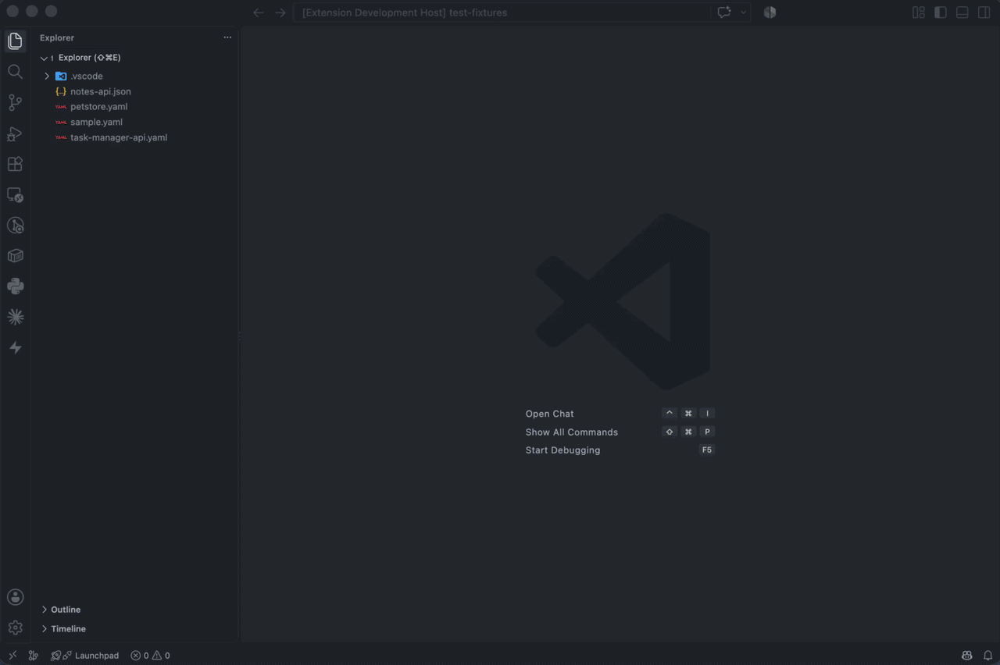

# Micro Mock

Right-click an OpenAPI spec, get a running mock API in seconds, with built-in chaos testing (error injection + latency) so you can see how your app behaves when the network misbehaves. Works with any project, in any language, it doesn't care whether the spec is yours or a third-party service's (e.g. mocking a vendor API your Go/Python/Rust/whatever app needs to call), only that a `.yaml`/`.yml`/`.json` file somewhere actually looks like an OpenAPI spec.

## Requirements

OpenAPI 3.0 / 3.x specs. Swagger 2.0 is not supported.

## Features

- **Start Mock Server** - right-click any `.yaml`/`.yml`/`.json` OpenAPI 3.x file (or run the command and pick one) to spin up a local mock server backed by [Prism](https://github.com/stoplightio/prism).
- **Live reload** - edit and save the spec file while the mock is running and it reloads automatically on the same URL, no restart needed. If the edited spec has an error, the previous working mock keeps running and you get an error message instead of a broken server.
- **Micro Mock sidebar** (Activity Bar) - start/stop the server, add any status code with its own independent % chance of being returned, set latency, browse the spec's endpoints, call them, and watch the last 10 requests that hit the server (method, path, status, latency) live.
- **Call endpoints without leaving VS Code** - pick an endpoint from the sidebar to open the Micro Mock panel: an editable request (method/URL, headers, JSON body) plus a live history of every request that's hit the mock, from the panel, your app, or curl alike, each with its full response body a click away.
- **Status bar indicator** - shows running/stopped state; click to open the sidebar.

Everything runs locally on your machine. No account, no cloud, no billing.

## Usage

1. Right-click an OpenAPI spec file → **Micro Mock: Start Mock Server** - the sidebar opens automatically once it's running. Using the ▶ button in the sidebar instead (no file pre-selected) shows a picker of every `.yaml`/`.yml`/`.json` in your project (excluding `node_modules`, `vendor`, and other common build/dependency dirs), type part of your spec's filename to filter it down.
2. In the sidebar: **+ Add error code** to give any HTTP status code (e.g. 500, 429) its own % chance of firing; click an existing one to change its %, or use the inline trash icon to remove it. Click **Latency** to set an artificial delay (ms).
3. Watch **Recent Requests** fill up as your app calls the mock, newest first, capped at 10. Click it (or any entry) to open the full panel; use the toolbar's clear-all button to reset the sidebar list.
4. Click any entry under **Endpoints** to open the Micro Mock panel, prefilled from the spec: path params filled in with realistic values, any *required* query/header params, a matching JSON body for POST/PUT/PATCH, and the `Authorization` header if the operation requires auth (bearer/basic/API-key are auto-filled with a working dummy value). Optional query/header params are left out on purpose so the URL doesn't get cluttered, add them yourself if you need them. Edit anything freely, then hit **Send Request** (a spinner shows while waiting, useful once you've cranked latency up). The history below updates live (it's the same traffic as Recent Requests, with full bodies), click a row to expand its response. **Copy as cURL** grabs the current request (method, URL, headers, body) as a ready-to-paste `curl` command.
5. Requests aren't restricted to what the spec defines or to "correct" HTTP GET with a body, arbitrary headers, whatever your real API actually does is fine; nothing here enforces spec compliance client-side (though Prism's mock responses still follow the OpenAPI spec).

## Settings

| Setting | Default | Description |
|---|---|---|
| `microMock.port` | `4010` | Preferred local port (falls back to next free port if taken). |
| `microMock.errorCodes` | `[]` | Array of `{ code, percent }` - each status code's independent chance of being returned instead of the real mock response. Edit via the sidebar rather than by hand. |
| `microMock.latencyMs` | `0` | Artificial delay (ms) added to every response. |

## Try it

A few fixtures to try Micro Mock against:

- `test-fixtures/sample.yaml` - tiny two-endpoint spec, no auth.
- `test-fixtures/task-manager-api.yaml` - realistic multi-resource sample (users, projects, tasks, comments, pagination, filtering, enums, nested objects, required bearer auth).
- `test-fixtures/notes-api.json` - JSON-format spec (the others are YAML), uses an API key passed as a query param instead of a header.
- `test-fixtures/petstore.yaml` - the real official Swagger Petstore spec (OpenAPI 3.2), oauth2 auth.

## Known current limitations (possibly matter of change in future)

- One mock server at a time per VS Code window
- Mocks are stateless (a `POST` won't be remembered by a later `GET`)
- The request log is in-memory only, it resets when the mock server stops or the window reloads
- Very large, heavily cross-referenced specs (e.g. Stripe's full public OpenAPI spec with thousands of schemas) can take a long time to parse
